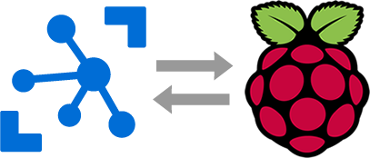

Azure IoT Hub RPi Toolkit
==================

Version 1.0.0

Author marazt

Copyright marazt

License The MIT License (MIT)

Last updated 02 March 2017

About
-----------------

A bunch of utilities for management and communication between Azure IoT Hub and Raspberry Pi (or other) devices.
Authors of original code are mentioned in particular projects and/or files.

Projects
-----------------
+ **AzureIoTRegistryManager**
App for IoT Hub management (add/list/remove)

+ **PythonTools**
Classes for sending/receiving data to/from IoT Hub via Python

Versions
-----------------

**1.0.0 - 2017/03/02**

* First version with device manager and Python client